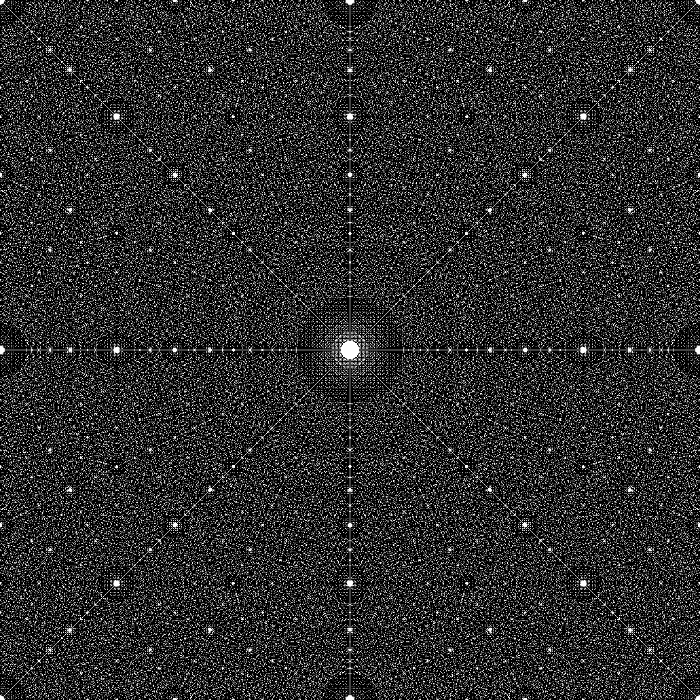

# Chaotic Sensing (ChaoS)


A Python library of algorithms for sparse signal/image recovery via fractal sampling known as Chaotic Sensing (ChaoS) found in the open-access publication
```
Chandra, S. S.; Ruben, G.; Jin, J.; Li, M.; Kingston, A.; Svalbe, I. & Crozier, S.
Chaotic Sensing,
IEEE Transactions on Image Processing, 2018, 1-1
```

* See [IEEE publication page](https://doi.org/10.1109/TIP.2018.2864918) for more details.
* DOI: [https://doi.org/10.1109/TIP.2018.2864918](https://doi.org/10.1109/TIP.2018.2864918)
* Code: [GitHub Repository - https://github.com/shakes76/ChaoS](https://github.com/shakes76/ChaoS)
* Website: [GitHub Pages - https://shakes76.github.io/ChaoS/](https://shakes76.github.io/ChaoS/)

The newly discovered finite fractal is also presented in this work, see above.

Please cite this work if you use any part of this repository to ensure more work of this type is also made publically available in the future.

## In a nutshell
The pattern and its process are akin to trying to see the reflection of your face in the surface of a pond. When we measure completely, without trying to be efficient or smart and ensuring we get all the information possible, it is if there is no disturbance in the pond and your face is easy to see. However, the conditions must be perfect and, in terms of MRI, it takes a long time to acquire all these measurements, but the image of the organ/tissue is straight forward to obtain. 

The fractal nature of the pattern is important because when we discard or have missing measurements, it is as if the surface of the pond is no longer still. In fact, the pond surface becomes disturbed with many, many ripples that is usually no way to resolving or reconciling a face on the surface anymore. What the fractal nature of the pattern allows us to do is to ensure that these ripples interact with each other in such a precise way that they all cancel each other out, so that we can see our face once again. The cancelling out of these artefacts is done to produce turbulence among them and amounts to inducing a chaotic mixing of image information, which is why the work is called Chaotic Sensing. 

We discuss more details on this and other core components of the work on the [wiki page](https://github.com/shakes76/ChaoS/wiki).

## ChaoS Library
This is a Python library for implementing ChaoS algorithms and finite Radon transforms.

**Warning: Although compatible for Python 3, the library has been developed under Python 2.7.13 and all results in the paper correspond only to this version.**

There are a number of sub-modules:

* radon - this houses the finite Radon transform algorithms
* mojette - this houses the aperiodic Radon transform algorithms
* tomo - this houses the traditional reconstruction sampling

The main scripts for generating the results of the [publication](https://doi.org/10.1109/TIP.2018.2864918) can be found in
* projects/finite_fractal - To generate the fractal see test_finite_farey_fractal.py
* projects/simulation - To run simulations of the reconstruction algorithms see test_finite_slices_osem_plot.py and test_finite_slices_ossirt_plot.py. Then run the test_compute_metrikz.py to generate the relevant metrics and figures.
* projects/matlab - Scripts used for modifying the MATLAB from Lustig 2007

### Scripts
To run the chaotic sensing scripts, use the following scripts in the projects/simulation directory: test_finite_slices_osem_plot.py test_finite_slices_ossirt_plot.py

This should give you individual results for the reconstructions and output matrices in NPZ files. You can evaluate performances WRT CS using the test_compute_metrics.py script. You can change the image by commenting/uncommenting/adding the relevant lines in those scripts.

To view the fractal, run the script projects/finite_fractal/test_finite_farey_fractal.py

### Data
The output results from both the CS and ChaoS methods have been provided in the Releases section. The phantom MR data will be released open source at a later date.

## Setup/Dependencies
### WinPython Method
The ChaoS library is dependent on the usual Numpy, Scipy, Matplotlib and scikit-image libraries. You may need pyFFTW installed as well.
The best way to set this up in Windows is using the [WinPython scientific distribution](https://sourceforge.net/projects/winpython/files/WinPython_2.7/2.7.13.1/) for Python 2.7.13.
WinPython sets up a Python distribution with minimal libraries, but in a compact stand-alone directory without the need to install.
In the interest of reproducibility, I have uploaded my WinPython distribution. Simply download, extract, launch Spyder from the distribution, open the script you wish to run and run it.

### Anaconda Method
Give this a go in a conda environment. By default, mine had Qt5 installed, so it breaks lines which explicitly selects Qt4Agg. I suggest just removing that line. 
The environment I used is attached in Releases section, created with:
```
$ conda env export > environment.yml
```

To reproduce it if you want, install miniconda then do
```
$ conda env create -f environment.yml
```

After that,
```
python -m test_finite_farey_fractal.py 
```
etc.

## Known Issues
* Python 3.5 has issues running the SSIM metric.

## License
Nearly all parts of the library is licensed under the [Apache 2.0 license](http://www.apache.org/licenses/LICENSE-2.0) and is outlined in the license.txt file.
```
Copyright 2018 Shekhar S. Chandra

Licensed under the Apache License, Version 2.0 (the "License");
you may not use this file except in compliance with the License.
You may obtain a copy of the License at

    http://www.apache.org/licenses/LICENSE-2.0

Unless required by applicable law or agreed to in writing, software
distributed under the License is distributed on an "AS IS" BASIS,
WITHOUT WARRANTIES OR CONDITIONS OF ANY KIND, either express or implied.
See the License for the specific language governing permissions and
limitations under the License.
```
The exception is the generation of fractals and figures from this repository. All figures and figures from the code pertaining to the display, saving and generation of fractals, are covered under the [Creative Commons Attribution-NonCommercial-ShareAlike 4.0 International Public License](http://creativecommons.org/licenses/by-nc-sa/4.0/).
For publication and commercial use of this content, please obtain a suitable license from the author.

The modified MATLAB scripts from Lustig 2007 are copyright by Lustig and are only provided in the interest of reproducibility.
